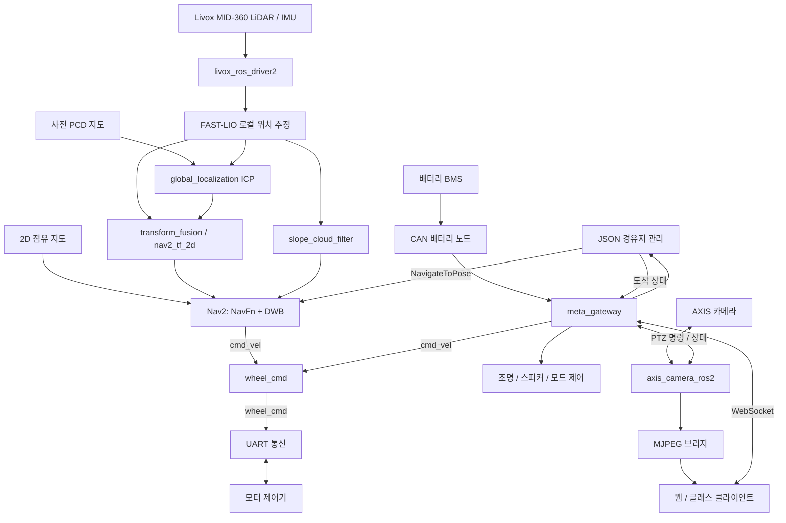
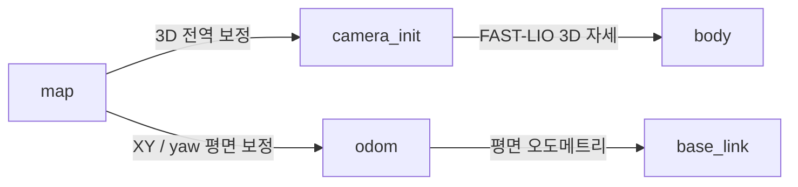

# patrol_robot

# Patrol Robot | ROS 2 기반 자율주행 순찰 로봇

> LiDAR·IMU 위치 추정부터 경사면 장애물 필터링, 경유지 주행, 모터 제어, 카메라 영상 전송과 원격 관제까지 연결한 로봇 소프트웨어 시스템입니다.

<!-- 대표 사진을 준비한 뒤 아래 주석을 해제하세요.

-->

**대표 이미지 위치:** 로봇 전체 모습에 MID-360, AXIS 카메라, 전조등, 경고등의 위치를 표시한 사진을 넣습니다.

<!-- 대표 영상의 썸네일과 실제 영상 주소를 넣고 주석을 해제하세요.
[](DEMO_VIDEO_URL)
-->

**대표 영상 위치:** 위치 추정 → 경유지 선택 → 자율주행 → 카메라 관제 → 조명·방송 제어를 보여주는 1~2분 영상을 넣습니다.

## 목차

1. [프로젝트 개요](#프로젝트-개요)
2. [시스템 구성과 데이터 흐름](#시스템-구성과-데이터-흐름)
3. [전체 소스 구조](#전체-소스-구조)
4. [패키지별 상세 역할](#패키지별-상세-역할)
5. [핵심 설계와 문제 해결](#핵심-설계와-문제-해결)
6. [주요 인터페이스](#주요-인터페이스)
7. [빌드 및 실행](#빌드-및-실행)
8. [시연 구성과 결과 기록](#시연-구성과-결과-기록)
9. [개발 기여와 확장 과제](#개발-기여와-확장-과제)
10. [문서와 오픈소스](#문서와-오픈소스)

## 프로젝트 개요

### 목표

순찰 로봇이 사전 제작된 지도에서 자신의 위치를 추정하고 지정한 경유지로 이동하도록 구성합니다. 주행 중에는 LiDAR 점군으로 주변 장애물을 반영하고, 운영자는 원격 클라이언트에서 카메라 영상과 로봇 상태를 확인하며 주행·조명·방송·카메라 방향을 제어할 수 있습니다.

이 저장소의 `src`는 로봇 측 ROS 2 패키지와 통신 브리지를 포함합니다. 외부 웹앱·글래스 앱의 전체 프런트엔드, 모터 제어기 펌웨어, 하드웨어 회로 설계는 이 디렉터리의 설명 범위에 포함되지 않습니다.

### 구현 범위

| 영역 | 구현 내용 | 관련 패키지 |
|---|---|---|
| 센서 수집 | Livox MID-360 점군 및 IMU 데이터 수신 | `livox_ros_driver2` |
| 위치 추정 | FAST-LIO 로컬 오도메트리, 사전 PCD 지도 ICP 정합, 전역 위치 보정 | `fast_lio_localization` |
| 주행 환경 인식 | 지역 지면 추정, 경사면 제거, 장애물 등록·제거용 점군 분리 | `slope_cloud_filter` |
| 경로 계획 | Nav2 전역 경로 계획, DWB 지역 경로 추종, Costmap 구성 | `bringup` + 외부 Nav2 |
| 경유지 이동 | JSON 좌표 기록, 순방향·역방향 경유지 이동, 목표 변경과 도착 알림 | `bringup` |
| 구동 제어 | 속도 명령의 좌우 바퀴 명령 변환, UART 송수신, Auto/Manual 모드 | `bringup` |
| 원격 관제 | WebSocket 명령 변환, 배터리·경유지·카메라 상태 중계 | `gateway_pk` |
| 영상 및 PTZ | AXIS MJPEG 수신, ROS 영상 발행, Pan/Tilt/Zoom 제어 | `axis_camera_ros2`, `axis_camera_msgs` |
| 영상 확인 | OpenCV 뷰어와 브라우저용 영상·제어 브리지 | `axis_image_processor`, `axis_web_bridge` |
| 주변 장치 | CAN 배터리 상태 수신, GPIO 조명, 경고음 재생 | `can_communication`, `bringup` |
| 대체 계획기 | TEB 최적화 및 Costmap의 기하 장애물 변환 구현 | `teb_local_planner`, `costmap_converter` |

### 개발 환경과 기술

- **실행 환경:** ROS 2 Humble 기반 Linux 워크스페이스. GPIO·CAN 코드는 Jetson AGX Orin 환경을 전제로 작성되어 있습니다.
- **언어:** Python, C++, YAML, JSON, Bash.
- **로봇 통신:** ROS 2 Topic / Service / Action, TF2, UART, SocketCAN.
- **위치 추정·점군 처리:** FAST-LIO, PCL, Eigen, ikd-Tree, IKFoM, NumPy.
- **주행:** Nav2, NavFn, DWB, Costmap, 선택 구성인 TEB·g2o.
- **영상·관제:** OpenCV, cv_bridge, HTTP MJPEG, WebSocket, aiohttp.

**문서 기준:** 현재 소스, 실행 파일 등록, launch 및 설정 파일을 기준으로 작성했습니다. 아래의 주기·속도·허용 오차는 설정값이며 실측 성능을 의미하지 않습니다. 개발 기간, 개인 담당 범위, 주행 성공률 등은 실제 기록을 추가하도록 별도로 마련했습니다.

## 시스템 구성과 데이터 흐름

### 전체 아키텍처



이 그림은 각 서브시스템을 함께 실행했을 때의 연결 관계입니다. **`bringup_all.launch.py` 하나가 그림의 모든 노드를 시작하지는 않습니다.** 실제 실행 범위는 아래 launch 표와 실행 절차를 따릅니다.

### 좌표계 설계



- `camera_init → body`는 FAST-LIO의 3차원 자세를 표현합니다.
- `transform_fusion`은 전역 보정과 로컬 오도메트리를 결합해 `map → camera_init` 및 `/localization`을 제공합니다.
- `nav2_tf_2d`는 위치의 X·Y와 yaw를 추출해 `map → odom → base_link`, `/odom_2d`를 제공합니다.
- 경사면 필터는 자세를 이용해 지면을 판정하되 출력 점군의 헤더와 좌표계는 입력 `body` 기준을 유지합니다. `/cloud_global_filtered`라는 이름만으로 `map` 좌표계라고 해석하면 안 됩니다.

<!-- TF와 RViz 화면을 준비한 뒤 주석을 해제하세요.

-->

**사진 위치:** RViz에서 사전 지도, 현재 점군, 로봇 위치와 TF를 함께 표시한 화면을 넣습니다.

## 전체 소스 구조

```text
src/
├── README.md                       # 프로젝트 포트폴리오 및 코드 안내
├── bringup/                        # 실행 구성, 구동 제어, 경유지, 주변 장치
│   ├── bringup/                    # ROS 2 Python 노드
│   ├── launch/                     # 서브시스템별 launch
│   ├── config/                     # Nav2, PS4, 경유지 JSON, RViz 설정
│   ├── map/                        # 2D 지도 이미지와 YAML
│   └── tools/                      # 좌표 기록, 지도 변환, LiDAR 설정 도구
├── fastlio_localization_ros2/       # ROS 패키지명: fast_lio_localization
│   ├── src/                        # FAST-LIO, ICP, TF 융합 C++ 구현
│   ├── include/                    # ikd-Tree, IKFoM, 수학·상태 자료형
│   ├── fast_lio_localization/       # Python 위치 추정·지도 보조 구현
│   ├── config/                     # LiDAR별 설정
│   └── launch/, Log/, knowledge/   # 실행, 드리프트 분석, 기술 기록
├── livox_ros_driver2/               # Livox 센서 드라이버 및 메시지
├── slope_cloud_filter/             # 지역 지면 기반 장애물 점군 필터
├── gateway_pk/                     # 원격 관제 WebSocket 및 MJPEG 중계
├── axis_camera_msgs/               # AXIS 제어·상태 메시지
├── axis_camera_ros2/                # 카메라 영상 수신 및 PTZ 제어
├── axis_image_processor/            # ROS 영상 OpenCV 뷰어
├── axis_web_bridge/axis_web_bridge/ # 카메라 전용 HTTP / WebSocket 서버
├── can_communication/              # CAN 초기화 및 배터리 데이터 해석
├── teb_local_planner/
│   ├── teb_local_planner/          # TEB 지역 계획기
│   └── teb_msgs/                   # 궤적 및 최적화 피드백 메시지
└── costmap_converter/
    ├── costmap_converter/          # Costmap → 기하 장애물 변환
    └── costmap_converter_msgs/     # 장애물 메시지
```

`package.xml` 기준 ROS 패키지는 총 **14개**입니다. 디렉터리 이름과 ROS 패키지 이름이 다른 위치 추정 패키지, 한 디렉터리 안에 여러 패키지를 담은 TEB·Costmap 구성을 구분해야 합니다.

## 패키지별 상세 역할

### 1. bringup — 로봇 실행과 제어의 중심

#### 실행 파일

| 파일 | 역할 및 실제 실행 범위 |
|---|---|
| [bringup_all.launch.py](bringup/launch/bringup_all.launch.py) | 구동부를 시작하고 조명·스피커·모드·CAN·배터리 노드를 시간차로 시작합니다. |
| [bringup.launch.py](bringup/launch/bringup.launch.py) | `uart`, `wheel_cmd` 두 노드를 실행합니다. |
| [bringup_localization.launch.py](bringup/launch/bringup_localization.launch.py) | MID-360 드라이버와 FAST-LIO 위치 추정 launch를 포함합니다. PCD 경로와 센서 설정을 전달합니다. |
| [bringup_navigation.launch.py](bringup/launch/bringup_navigation.launch.py) | `nav2_tf_2d`, Map Server, 지도 Lifecycle Manager, Nav2 navigation launch를 실행합니다. |
| [bringup_cam.launch.py](bringup/launch/bringup_cam.launch.py) | AXIS 영상·PTZ 노드를 포함하고 `view:=true`일 때 OpenCV 뷰어를 추가합니다. |
| [ps4_control.launch.py](bringup/launch/ps4_control.launch.py) | `joy_node`와 `ps4_control`을 PS4 YAML 설정으로 실행합니다. |

`bringup_all`의 예약 시각은 launch 시작을 기준으로 다음과 같습니다.

| 예약 시각 | 실행 노드 |
|---|---|
| 0초 | `bringup.launch.py`: UART, 바퀴 명령 변환 |
| 2초 | `light_node` |
| 4초 | `robot_speaker` |
| 6초 | `mode_keyboard` |
| 8초 | `can_up` |
| 10초 | `battery_status_publisher` |

`TimerAction`은 일정 시간이 지나면 실행을 예약하는 방식입니다. 앞선 장치가 정상 준비되었는지를 확인하는 의존성 제어는 아니므로 CAN 설정이 늦어지면 배터리 노드가 먼저 시작될 수 있습니다.

#### 주요 노드

| 코드 | 상세 역할 |
|---|---|
| [uart_ros2_humble.py](bringup/bringup/uart_ros2_humble.py) | `/dev/ttyUSB0`, 115200 baud를 기본으로 모터 제어기와 통신합니다. 수신 스레드와 ROS 콜백을 분리하고 바이트 단위 프레임 파싱, 체크섬 처리, 휠 상태 발행, 모드·휠 명령 송신을 담당합니다. |
| [wheel_cmd_ros2_humble.py](bringup/bringup/wheel_cmd_ros2_humble.py) | `/cmd_vel`의 선속도·각속도를 좌우 바퀴 방향·속도 명령으로 변환합니다. 모드 확인, 장애물 입력에 따른 감속, 부드러운 출발, 방향 반전 시 정지 명령 삽입, 명령 수신 timeout을 처리합니다. |
| [mode_keyboard_ros2_humble.py](bringup/bringup/mode_keyboard_ros2_humble.py) | 키보드 `a/m/q` 또는 `/server/robot_mode`를 받아 UART 모드값으로 변환합니다. 서버에서 Manual 명령을 받으면 Nav2 목표 취소를 요청합니다. launch 환경처럼 TTY가 없으면 토픽 제어만 동작합니다. |
| [nav2_tf_2d.py](bringup/bringup/nav2_tf_2d.py) | `/Odometry`와 `/map_to_odom`으로 Nav2용 평면 TF와 `/odom_2d`를 발행합니다. 전역 보정 수신 전에는 `map → odom`을 항등 변환으로 발행합니다. |
| [json_navigation.py](bringup/bringup/json_navigation.py) | JSON의 첫 초기 자세를 발행하고, 번호로 받은 목적지까지 중간 경유지를 순서대로 방문합니다. Nav2 Action 수락·피드백·결과를 처리하며 새 목적지가 오면 기존 목표 취소 후 경로를 다시 구성합니다. |
| [ps4.py](bringup/bringup/ps4.py) | 조이스틱 방향을 고정 속도 명령으로 저장해 반복 발행합니다. 스틱을 중립으로 되돌려도 명령을 유지하는 latch 방식이며 정지 버튼 또는 Auto 버튼에서 정지 처리를 수행합니다. 방향 입력 시 기존 Nav2 목표의 취소를 요청합니다. |
| [robot_connection.py](bringup/bringup/robot_connection.py) | `/robot/connection`의 `SetBool` 서비스에 1초 간격으로 준비 상태를 요청합니다. 성공 응답 후 `bringup_all`을 자식 프로세스로 시작하고 노드 종료 시 해당 프로세스의 종료를 요청합니다. 서비스 서버는 별도 구성 요소가 제공해야 합니다. |
| [light_node.py](bringup/bringup/light_node.py) | Jetson GPIO BOARD 번호 13·18을 사용해 두 조명 출력을 제어합니다. `/server/light_cmd`의 0~3을 해석하고 종료 시 출력을 끄고 GPIO를 정리합니다. |
| [robot_speaker.py](bringup/bringup/robot_speaker.py) | `/server/speaker`의 1을 받으면 오디오 파일을 반복 재생하고 0이면 중지합니다. 재생 프로세스를 관리하며 DDS 도메인을 코드에서 84로 설정합니다. |

#### 바퀴 명령 변환

차동구동의 기본 관계는 다음과 같습니다.

```text
왼쪽 바퀴 선속도 = v - ω × L / 2
오른쪽 바퀴 선속도 = v + ω × L / 2

v: 전진 선속도, ω: 회전 각속도, L: 좌우 바퀴 간격
wheel_cmd: [왼쪽 방향, 왼쪽 속도, 오른쪽 방향, 오른쪽 속도, 브레이크]
```

현재 기본 바퀴 간격은 `0.54 m`입니다. 계산된 속도는 변환 계수와 정지 오프셋 `33`을 적용해 제어기 명령으로 바뀝니다. `wheel_speed_coefficient=3.6`의 물리 단위와 실제 속도 대응은 모터 사양 및 실측 보정으로 확인해야 합니다.

`wheel_cmd`는 Auto 상태에서 ROS 주행 명령을 처리하며 Manual 상태에서는 이를 전달하지 않습니다. 화면에서 사람이 직접 조작하는 것과 모터 제어기의 Manual 모드는 서로 다른 개념이므로 원격 `/cmd_vel` 제어 시 이 모드 규칙을 함께 맞춰야 합니다.

#### 지도·좌표·설정 도구

| 파일 또는 디렉터리 | 역할 |
|---|---|
| [pose_coordinate_recorder.py](bringup/tools/pose_coordinate_recorder.py) | RViz의 `/initialpose`, `/clicked_point`, `/goal_pose`를 시간 정보와 함께 새 JSON에 저장합니다. |
| [pose_z_waypoint_saver.py](bringup/tools/pose_z_waypoint_saver.py) | RViz에서 선택한 초기·목표 자세에 3D PCD 지도에서 추정한 지면 Z를 결합해 저장합니다. |
| [convert_map_resolution.py](bringup/tools/convert_map_resolution.py) | 점유 지도 해상도를 낮추면서 월드 좌표 관계를 유지하도록 이미지와 YAML을 변환합니다. 장애물 보존을 고려한 축소 처리가 포함됩니다. |
| [set_mid360_fov.cpp](bringup/tools/set_mid360_fov.cpp) | Livox SDK를 이용한 MID-360 시야각 설정 도구입니다. 같은 디렉터리의 실행 바이너리는 해당 코드의 실행 산출물입니다. |
| [slope_cloud_filter_node.py](bringup/tools/slope_cloud_filter_node.py) | 필터의 도구용 구현입니다. 이 문서의 주 실행 경로는 별도 `slope_cloud_filter` 패키지의 등록된 노드를 사용합니다. |
| [nav2_pcd_params.yaml](bringup/config/nav2_pcd_params.yaml) | 현재 navigation launch가 읽는 Nav2 기본 설정입니다. |
| `config/nav2_pcd_params_*.yaml`, `newone.yaml` | 주행 조건과 계획기를 달리한 설정 변형입니다. 파일이 존재해도 현재 launch가 자동 선택하지는 않습니다. |
| [config/point_map](bringup/config/point_map) | 초기 자세·목표 자세 기록 및 환경별 경유지 JSON을 보관합니다. |
| [config/ps4/ps4_teleop.yaml](bringup/config/ps4/ps4_teleop.yaml) | 조이스틱 축·버튼 매핑과 속도 설정입니다. |
| [map](bringup/map), [config/full_nav.rviz](bringup/config/full_nav.rviz) | 2D 점유 지도와 주행 시각화 설정입니다. 현재 launch가 사용하는 외부 지도 경로와 저장소 내 예시 지도는 구분해야 합니다. |
| [tools/screaming.mp3](bringup/tools/screaming.mp3) | 스피커 노드에서 사용하는 기본 경고음 자산입니다. |

### 2. fast_lio_localization — LiDAR·IMU 위치 추정

디렉터리는 `fastlio_localization_ros2`이지만 `ros2 launch`에 사용하는 패키지명은 **`fast_lio_localization`**입니다.

| 코드 또는 구성 | 상세 역할 |
|---|---|
| [src/laserMapping.cpp](fastlio_localization_ros2/src/laserMapping.cpp) | LiDAR·IMU 버퍼를 처리하고 반복 필터 업데이트와 스캔-지도 대응으로 로컬 자세를 추정합니다. 점군, 오도메트리, 선택적 경로·지도 출력을 발행하며 전역 지도용 추가 트리를 사용하는 코드도 포함합니다. |
| [src/preprocess.cpp](fastlio_localization_ros2/src/preprocess.cpp), `preprocess.h` | 센서별 점군 형식·시간 정보를 처리하고 점 필터링 등 후속 추정에 필요한 입력을 준비합니다. |
| [src/IMU_Processing.hpp](fastlio_localization_ros2/src/IMU_Processing.hpp) | IMU 초기화와 상태 예측, 스캔 중 움직임에 의한 점군 왜곡 보정에 사용됩니다. |
| [src/global_localization.cpp](fastlio_localization_ros2/src/global_localization.cpp) | PCD 지도와 현재 점군을 다운샘플링하고 coarse/fine ICP를 수행합니다. 정합률과 RMSE 기준을 통과한 변환을 `/map_to_odom`으로 발행합니다. |
| [src/transform_fusion.cpp](fastlio_localization_ros2/src/transform_fusion.cpp) | 전역 보정 행렬과 로컬 오도메트리를 곱해 지도 기준 로봇 자세를 계산합니다. `/localization`과 3D TF를 제공합니다. |
| [include/ikd-Tree](fastlio_localization_ros2/include/ikd-Tree) | 점 추가·삭제 및 최근접점 탐색을 지원하는 동적 공간 인덱스입니다. |
| [include/IKFoM_toolkit](fastlio_localization_ros2/include/IKFoM_toolkit), `include/use-ikfom.hpp` | 필터 상태, 회전 등 상태 공간의 수학 연산과 반복 Kalman 필터 기반 추정에 사용됩니다. |
| `include/common_lib.h`, `Exp_mat.h`, `so3_math.h` | 공통 자료형, 회전·행렬 계산 및 알고리즘 보조 함수를 제공합니다. |
| [msg/Pose6D.msg](fastlio_localization_ros2/msg/Pose6D.msg) | IMU 처리 등에 사용하는 자세·운동 상태 메시지 정의입니다. |
| [config/mid360.yaml](fastlio_localization_ros2/config/mid360.yaml) | MID-360 토픽, 센서 외부 파라미터, 필터 크기, 출력 및 지도 저장 옵션을 설정합니다. 다른 YAML은 Avia·Horizon·Velodyne·Ouster·Hesai·Unilidar 등 센서별 변형입니다. |
| [launch/localization.launch.py](fastlio_localization_ros2/launch/localization.launch.py) | C++ 위치 추정 3개 노드, PCD 발행 노드, 선택적 RViz를 실행합니다. 나머지 launch는 센서별 실행·PCD 로드 확인 용도입니다. |
| [fast_lio_localization](fastlio_localization_ros2/fast_lio_localization) | Python판 `global_localization.py`, `transform_fusion.py`, 초기 자세 발행, Livox 스캔 반전, PCD 발행 도구를 보관합니다. 현재 기본 launch는 C++ 실행 파일을 사용합니다. |
| [src/pointcloud_to_ros_map.py](fastlio_localization_ros2/src/pointcloud_to_ros_map.py) | 점군을 ROS 점유 지도 형식으로 변환하는 보조 도구입니다. |
| [Log/analyze_drift.py](fastlio_localization_ros2/Log/analyze_drift.py), `Log/plot.py`, `Log/fast_lio_time_log_analysis.m` | 드리프트 진단 CSV와 상태·처리시간 로그를 분석·시각화하는 Python/MATLAB 도구입니다. |
| `start_*.sh`, `run_localization.sh`, `quick_start_cpp.sh`, `test_cpp_nodes.sh` | 개별 위치 추정 실행 및 점검을 위한 보조 스크립트입니다. 내부 경로와 실행 옵션은 사용 환경에 맞춰 확인합니다. |
| `knowledge/`, `docs/`, `rviz/`, `rviz_cfg/` | 알고리즘·개발 기록과 위치 추정 시각화 설정을 담습니다. |

**현재 기본 동작:** `mid360.yaml`의 `global_map.global_map_enabled`는 `false`입니다. FAST-LIO 내부의 전역 지도 경로를 직접 활성화하는 대신 외부 `global_localization`이 사전 지도 ICP를 담당합니다. 또한 기본 launch는 FAST-LIO의 `/initialpose` 구독을 다른 토픽으로 remap하여 초기 자세 입력을 외부 전역 위치 추정 노드에서 처리하도록 구성합니다.

<!-- 위치 추정 시연 자료

[초기 자세 설정 및 위치 추정 영상](LOCALIZATION_VIDEO_URL)
-->

**사진·영상 위치:** 초기 자세를 지정한 뒤 현재 스캔이 사전 지도와 정렬되는 장면, 로봇 이동 중 지도 기준 위치가 갱신되는 장면을 넣습니다.

### 3. livox_ros_driver2 — 센서 데이터 입력

[Livox 드라이버](livox_ros_driver2)는 MID-360으로부터 데이터를 받아 ROS 메시지로 전달하는 센서 입구입니다.

| 코드 영역 | 역할 |
|---|---|
| `src/livox_ros_driver2.cpp`, `driver_node.cpp` | ROS 실행 진입점과 드라이버 노드를 구성합니다. |
| `src/lds.cpp`, `lds_lidar.cpp`, `lddc.cpp` | 센서 데이터 소스 관리, 수신 데이터 처리와 배포를 담당합니다. |
| `src/call_back/` | Livox SDK의 센서·데이터 콜백을 연결합니다. |
| `src/comm/` | 점군·IMU 큐, 캐시, 동기화, 발행 처리를 지원합니다. |
| `src/parse_cfg_file/` | 센서와 호스트 네트워크 설정 JSON을 읽습니다. |
| `msg/CustomPoint.msg`, `msg/CustomMsg.msg` | Livox 점별 속성과 시간 정보를 전달할 메시지를 정의합니다. |
| [launch_ROS2/msg_MID360_launch.py](livox_ros_driver2/launch_ROS2/msg_MID360_launch.py) | 현재 위치 추정 launch가 포함하는 드라이버 실행 파일입니다. `xfer_format=1`, `publish_freq=10.0`으로 설정되어 있습니다. |
| `config/*config.json`, `launch_ROS1/`, `launch_ROS2/` | 센서 종류·대수·ROS 버전에 따른 설정과 실행 변형입니다. |
| `3rdparty/rapidjson/` | 설정 파싱에 사용하는 외부 JSON 라이브러리입니다. |

현재 MID-360 구성에서 `/livox/lidar`는 **`livox_ros_driver2/msg/CustomMsg`**, `/livox/imu`는 **`sensor_msgs/msg/Imu`**입니다. FAST-LIO가 처리한 뒤 발행하는 `/cloud_registered`와 `/cloud_registered_body`는 `PointCloud2`입니다.

### 4. slope_cloud_filter — 경사면과 장애물 분리

핵심 구현은 [slope_cloud_filter_node.py](slope_cloud_filter/slope_cloud_filter/slope_cloud_filter_node.py), 설정은 [slope_filter.yaml](slope_cloud_filter/config/slope_filter.yaml)입니다.

처리 순서는 다음과 같습니다.

1. `/cloud_registered_body` 점군과 `/Odometry` 자세를 받습니다.
2. 최근 스캔들을 오도메트리로 보정해 현재 `body` 좌표계에 누적합니다.
3. roll·pitch 영향을 보정한 좌표에서 지면을 판정합니다.
4. 방위각과 거리로 나눈 **폴라 그리드**에 점을 배치하고 셀별 최저 높이를 계산합니다.
5. 가까운 셀부터 허용 경사와 높이 변화량을 적용해 지역 지면 높이를 추정합니다.
6. 지역 지면보다 높은 점을 장애물 후보로 남기고 너무 높은 점은 제외합니다.
7. 장애물 등록용, 빈 공간 제거용, 디버그용 점군을 각각 발행합니다.

| 주요 파라미터 | 기본 설정 | 의미 |
|---|---:|---|
| `azimuth_bins` | 36 | 방위각을 10도 간격으로 분할 |
| `radial_bin_size_m` | 0.5 m | 거리 방향 셀 크기 |
| `max_ground_slope_deg` | 20° | 지면 높이 갱신의 경사 허용값 |
| `ground_jump_tolerance_m` | 0.10 m | 셀 간 높이 변화 여유 |
| `obstacle_height_thresh_m` | 0.25 m | 지역 지면 기준 장애물 최소 높이 경계 |
| `max_obstacle_height_m` | 2.0 m | 장애물 상한 높이 경계 |
| `accumulate_scans` | 5 | 누적 스캔 수 |

20도는 **필터의 판정 설정**이며 로봇의 실측 등판 능력이 아닙니다. 낮은 장애물 누락 여부와 움직이는 물체의 누적 잔상은 실제 환경에서 확인해야 합니다.

<!-- 필터 전후 비교

[경사로 주행과 장애물 유지 시연](SLOPE_VIDEO_URL)
-->

**사진 위치:** 같은 시점의 원본 점군, 제거된 점군, 최종 Costmap을 나란히 배치합니다. 경사면은 제거되고 경사면 위 장애물은 남는 사례를 사용하면 처리 목적이 드러납니다.

### 5. Nav2 구성 및 선택적 TEB·Costmap Converter

#### 현재 기본 Nav2 설정

[nav2_pcd_params.yaml](bringup/config/nav2_pcd_params.yaml)은 다음 구성을 사용합니다.

| 구성 요소 | 설정과 역할 |
|---|---|
| 전역 계획기 | `nav2_navfn_planner/NavfnPlanner`, `use_astar: false`: Dijkstra 방식으로 지도 위 경로 계산 |
| 지역 제어기 | `dwb_core::DWBLocalPlanner`: 후보 속도의 궤적을 평가해 경로 추종 명령 선택 |
| 제어 주기 | `controller_frequency: 20.0` |
| 최대 전진·회전 속도 | DWB 기준 `0.4 m/s`, `1.0 rad/s` |
| 목표 허용 오차 | XY `0.25 m`, yaw `0.25 rad` |
| Local Costmap | `odom` 기준, 3 × 3 m 이동 창, 0.05 m 해상도 |
| Global Costmap | `map` 기준, Static + Obstacle + Inflation 레이어 |
| 로봇 형상 | 원형 반지름 `0.4 m` |
| 장애물 등록 | `/cloud_global_filtered` |
| 관측 기반 장애물 제거 | `/cloud_ground_clearing` |
| 보조 구성 | Behavior Tree, 경로 Smoother, 회전·후진·대기 Behavior, Velocity Smoother |

#### TEB 구현

[teb_local_planner](teb_local_planner/teb_local_planner)는 시간 간격과 로봇 자세로 구성된 궤적을 최적화하는 대체 지역 계획기입니다. **현재 기본 YAML에서는 활성화되지 않습니다.**

| 코드 영역 | 역할 |
|---|---|
| `src/teb_local_planner_ros.cpp` | Nav2 제어기 플러그인과 TEB 알고리즘을 연결합니다. |
| `src/timed_elastic_band.cpp` | 궤적을 구성하는 자세와 시간 간격을 관리합니다. |
| `src/optimal_planner.cpp`, `include/teb_local_planner/g2o_types/` | 시간·장애물·속도·가속도·운동학 제약을 g2o 최적화 문제로 구성합니다. |
| `src/homotopy_class_planner.cpp`, `src/graph_search.cpp` | 장애물을 서로 다른 방향으로 우회하는 경로 후보를 탐색·평가합니다. |
| `src/obstacles.cpp`, `recovery_behaviors.cpp` | 장애물 표현과 진동·정체 등 복구 판단을 지원합니다. |
| `src/teb_config.cpp`, `visualization.cpp` | 파라미터 처리와 궤적·장애물 시각화를 담당합니다. |
| `src/test_optim_node.cpp`, `test/`, `scripts/` | 최적화 예제, 테스트 장애물·경유점 발행, 속도 프로파일 시각화, 데이터 내보내기 도구입니다. 일부 스크립트는 ROS 버전 호환성을 확인해야 합니다. |
| [teb_msgs/msg](teb_local_planner/teb_msgs/msg) | `TrajectoryPointMsg`, `TrajectoryMsg`, `FeedbackMsg`로 궤적과 최적화 피드백을 표현합니다. |

#### Costmap Converter 구현

[costmap_converter](costmap_converter/costmap_converter)는 점유 셀을 점·선·다각형 등으로 바꿔 계획기에 전달하는 플러그인 모음입니다.

| 코드 영역 | 역할 |
|---|---|
| `src/costmap_converter_node.cpp`, `costmap_converter_plugins.xml` | 노드 실행과 변환 플러그인 로딩을 구성합니다. |
| `src/costmap_to_polygons.cpp`, `costmap_to_polygons_concave.cpp` | 점유 셀 군집에서 볼록·오목 다각형을 구성합니다. |
| `src/costmap_to_lines_convex_hull.cpp`, `costmap_to_lines_ransac.cpp` | 장애물 형상을 선분으로 근사합니다. |
| `src/costmap_to_dynamic_obstacles/` | 배경 분리, blob 검출, 동적 장애물 변환을 구현합니다. |
| `multitarget_tracker/Ctracker.cpp`, `HungarianAlg.cpp`, `Kalman.cpp` | 검출 물체와 기존 트랙의 대응, 추적 상태 예측·갱신을 담당합니다. |
| [costmap_converter_msgs/msg](costmap_converter/costmap_converter_msgs/msg) | `ObstacleMsg`, `ObstacleArrayMsg`로 장애물 형상과 상태를 전달합니다. |

이 코드가 존재한다는 사실과 실제 주행에서 동적 객체 추적을 사용한다는 것은 별개입니다. 현재 기본 Nav2 설정은 필터 점군을 `ObstacleLayer`에서 직접 사용합니다.

### 6. AXIS 카메라 및 영상 패키지

| 코드 | 상세 역할 |
|---|---|
| [axis_camera_msgs/msg/Axis.msg](axis_camera_msgs/msg/Axis.msg) | 시간, pan·tilt·zoom, focus·brightness·iris, 회전율, autofocus 필드를 정의합니다. 실제 사용 필드는 소비 노드에 따라 다릅니다. |
| [axis_camera_node.py](axis_camera_ros2/axis_camera_ros2/axis_camera_node.py) | 카메라 HTTP MJPEG 연결에서 multipart 경계와 JPEG 프레임을 읽어 `/axis/image_raw/compressed`로 발행합니다. |
| [axis_ptz_node.py](axis_camera_ros2/axis_camera_ros2/axis_ptz_node.py) | `/axis/axis_cmd`를 카메라 HTTP PTZ 요청으로 변환합니다. 홈 위치 복귀, 상태 조회, 명령 timeout 정지를 처리합니다. |
| [axis_camera.launch.py](axis_camera_ros2/launch/axis_camera.launch.py) | 영상 수신 노드와 PTZ 노드의 실행을 구성합니다. |
| [axis_image_processor/rgb_detector.py](axis_image_processor/axis_image_processor/rgb_detector.py) | 압축 영상을 cv_bridge로 변환해 OpenCV 창에서 표시합니다. 현재 구현은 객체 검출 모델을 실행하지 않습니다. |
| [axis_camera_ros2/rgb_detector.py](axis_camera_ros2/axis_camera_ros2/rgb_detector.py) | 카메라 패키지 내부에 보관된 유사 RGB 뷰어 구현입니다. `bringup_cam`의 선택 뷰어는 `axis_image_processor`를 사용합니다. |
| [axis_web_bridge/bridge_node.py](axis_web_bridge/axis_web_bridge/axis_web_bridge/bridge_node.py) | aiohttp 서버와 ROS 처리를 연결합니다. 기본 포트 8766에서 `/`, `/health`, `/stream.mjpg`, `/ws`를 제공하고 영상 전송·PTZ 명령·상태·timeout을 처리합니다. |

`axis_web_bridge`는 카메라 전용 브리지입니다. 아래 `gateway_pk`의 로봇 전체 관제 게이트웨이와 독립적인 실행 선택지입니다.

<!-- 카메라·관제 자료

[영상 전송 및 PTZ 제어 시연](CAMERA_VIDEO_URL)
-->

**영상 위치:** 클라이언트에서 좌우·상하 회전과 줌·홈 복귀를 조작하는 화면에 실제 카메라 움직임을 함께 보여줍니다.

### 7. gateway_pk — 로봇과 원격 클라이언트 연결

#### meta_gateway.py

[meta_gateway.py](gateway_pk/gateway_pk/meta_gateway.py)는 웹 JSON 메시지를 ROS 명령으로 변환하고 로봇 상태를 클라이언트에 전달합니다.

- `cmd_vel`: 선속도·각속도 입력 검증과 제한, `/cmd_vel` 발행.
- `robot_mode`: 현재 주행 명령 정지 후 Auto/Manual 전환 메시지 발행.
- `waypoint_goal`: 목적지 번호를 `/robot_nav/goal`로 전달.
- `camera_ptz`, `camera_home`: PTZ 제어 및 홈 복귀.
- `headlight`, `warning_light`, `emergency_broadcast`: 조명과 방송 제어.
- `emergency_stop`: 게이트웨이의 주행 명령을 0으로 설정.
- 로봇 → 클라이언트: 배터리 SOC, 도착 경유지, 선택 목적지, 카메라 상태, 속도 명령 등의 중계.

`topics.json` 기본값은 WebSocket **8765번 포트**, 원격 입력 최대 선속도 **0.18 m/s**, 최대 각속도 **0.5 rad/s**입니다. Nav2의 자체 속도 제한과 별도의 값입니다.

게이트웨이가 `/cmd_vel`에서 계산해 보여주는 속도는 **명령 속도**이며 실제 바퀴나 오도메트리로 측정한 주행 속도와 구분해야 합니다. 또한 `continuous=true` 주행은 명령을 저장해 반복 발행하므로 일반 단발 입력의 0.4초 timeout과 동작이 다릅니다.

#### 영상 및 실행 구성

| 파일 | 역할 |
|---|---|
| [axis_mjpeg_bridge.py](gateway_pk/gateway_pk/axis_mjpeg_bridge.py) | ROS `CompressedImage`의 JPEG 데이터를 재인코딩 없이 HTTP로 중계합니다. 최신 프레임 저장소와 스레드 기반 서버를 사용합니다. |
| [bringup_gateway.launch.py](gateway_pk/launch/bringup_gateway.launch.py) | 0초 게이트웨이 → 3초 카메라 launch → 6초 MJPEG 브리지를 예약합니다. |
| [topics.json](gateway_pk/config/topics.json) | 토픽 매핑, 포트, 원격 주행 제한값을 관리합니다. |
| [navigation_state.json](gateway_pk/config/navigation_state.json) | 게이트웨이의 현재 경유지 표시 상태를 보관합니다. `json_navigation` 내부 상태와 자동 동기화되는 영속 저장소는 아닙니다. |
| `config/run_gateway.sh`, `requirements.txt`, `coastal-axis-mjpeg.service` | 실행 환경, Python 의존성, 서비스 등록 예시입니다. |

기본 MJPEG 브리지 주소는 다음과 같습니다.

```text
http://ROBOT_IP:8080/stream    : 연속 영상
http://ROBOT_IP:8080/snapshot  : 최신 JPEG
http://ROBOT_IP:8080/health    : 프레임 수신 상태
ws://ROBOT_IP:8765            : 로봇 관제 WebSocket
```

### 8. can_communication — 배터리 상태 수집

| 코드 또는 구성 | 상세 역할 |
|---|---|
| [can_up.py](can_communication/can_communication/can_up.py) | Jetson CAN 인터페이스를 준비하고 `can0`, 500000 bit/s 설정을 적용합니다. 시스템 설정 명령에 필요한 권한을 사용합니다. |
| [battery_status_publisher.py](can_communication/can_communication/battery_status_publisher.py) | 비차단 SocketCAN 소켓에서 CAN ID `0x100`의 프레임을 읽고 8바이트 데이터의 배터리 정보를 해석합니다. |
| [bringup_can.launch.py](can_communication/launch/bringup_can.launch.py) | CAN 관련 노드의 별도 실행 진입점입니다. |
| [battery_can.yaml](can_communication/config/battery_can.yaml) | 인터페이스, CAN ID, 발행 토픽 등 배터리 수신 설정입니다. |
| `config/can_setup.sh`, `start_battery_can.sh`, `run_publisher.sh` | CAN 설정 및 배터리 노드 실행 보조 스크립트입니다. |
| `config/install_autostart.sh`, `verify_battery_topic.sh` | 자동 시작 구성 및 토픽 확인 도구입니다. |

출력은 `sensor_msgs/BatteryState`가 아니라 **`std_msgs/msg/String` 안의 JSON**입니다.

```json
{
  "mode": "Discharging",
  "fault": "Normal",
  "soc": 80,
  "soh": 98,
  "remaining_time_min": 120
}
```

위 숫자는 형식 설명을 위한 예시입니다. SOC는 충전 잔량, SOH는 배터리 건강 상태이며, 잔여 시간 필드는 기본 little-endian으로 해석합니다. 게이트웨이는 이 JSON의 `soc`를 읽어 화면에 전달합니다.

<!-- 주변 장치 사진

-->

**사진 위치:** 전조등·경고등 작동 모습과 관제 화면의 배터리 잔량을 함께 넣습니다.

### 9. 공통 패키징·테스트·보관 파일

- `package.xml`: 패키지명, 의존성, 라이선스 등 ROS 패키지 메타데이터입니다.
- `setup.py`, `setup.cfg`, `resource/`, `__init__.py`: Python 패키지 설치, 실행 파일 등록, ament 인덱스 및 모듈 구성을 담당합니다.
- `CMakeLists.txt`: C++ 컴파일, 메시지 생성, 라이브러리 연결, launch·설정 설치를 구성합니다.
- `test/test_flake8.py`, `test_pep257.py`, `test_copyright.py`: 주로 코드 스타일·문서 문자열·저작권 표기 검사입니다. 실제 주행 기능 검증 결과를 대신하지 않습니다.
- TEB·Costmap Converter의 `test/`: 알고리즘 및 기본 자료구조 관련 C++ 테스트를 포함합니다.
- `__pycache__/`, `*.egg-info/`, 로그, 컴파일 바이너리: 실행·설치·진단 산출물입니다. 별도 기능 모듈로 집계하지 않습니다.
- `(copy)`·`.bak_*` 파일: 설정 또는 코드의 보관 사본입니다. 기본 실행 대상을 판단할 때는 launch와 `console_scripts` 등록을 우선합니다.

## 핵심 설계와 문제 해결

### 1. 경사로가 장애물 벽으로 표시되는 문제

**문제 상황:** 고정 높이 기준으로 점군을 장애물에 넣으면 로봇이 오르막에 진입할 때 지면이 장애물로 잡혀 주행 경로를 막을 수 있습니다.

**구현한 대응:** 방위각·거리 셀마다 지역 지면 높이를 추정하고 그 지면에서의 상대 높이로 장애물을 판정합니다. 로봇 자세로 roll·pitch를 보정하고 누적 스캔을 현재 좌표계로 옮겨 사용합니다.

**확인할 결과:** 경사면이 Costmap에서 제거되는지, 경사면 위 실제 장애물이 유지되는지, 낮은 연석이 누락되지 않는지 비교합니다.

### 2. 장애물 제거용 관측과 장애물 등록용 관측 분리

**문제 상황:** 지면 점을 모두 제거한 점군만 사용하면 Costmap이 빈 공간을 확인할 관측도 부족해져 이전 장애물의 흔적이 남을 수 있습니다.

**구현한 대응:** 장애물 점군은 marking에, 지면을 포함하되 높은 점을 제한한 별도 점군은 clearing에 사용합니다. 등록과 제거를 서로 다른 observation source로 설정합니다.

**확인할 결과:** 장애물을 치운 뒤 Costmap 잔상이 사라지는 시간과 실제 장애물이 과도하게 지워지지 않는지를 기록합니다.

### 3. 3D 위치 추정과 2D 주행 좌표계 연결

**문제 상황:** 경사 지형에서 얻는 3D 자세를 평면 주행에 연결하려면 전역 위치 보정과 연속적인 로컬 운동을 일관된 좌표계로 제공해야 합니다.

**구현한 대응:** FAST-LIO 로컬 추정과 외부 ICP 전역 보정을 분리하고, `nav2_tf_2d`에서 Nav2용 평면 분기를 생성합니다. 초기 자세는 로컬 추정 원점을 직접 바꾸지 않고 외부 전역 보정에 반영합니다.

**확인할 결과:** 초기 자세 재설정 전후 TF 연속성, 정합 품질, 평면 주행 경로와 3D 지도상 위치의 일치 정도를 확인합니다.

### 4. 목적지 변경을 반영하는 경유지 상태 관리

`json_navigation`은 마지막 도착 번호를 기준으로 중간 경유지를 구성합니다.

```text
시작 상태 0에서 3 요청 → 1 → 2 → 3
3에 도착한 뒤 1 요청 → 2 → 1
이동 도중 다른 목적지 요청 → 현재 Action 취소 → 새 경유지 목록 구성
```

목표가 실패하면 해당 경로를 중단합니다. Action 서버가 준비되지 않았을 때 기다리는 재시도와 실제 주행 실패 후 재시도는 구분됩니다. 노드를 재시작하면 내부 현재 경유지는 0부터 시작합니다.

### 5. 통신 입력과 구동 명령의 보호 처리

| 계층 | 코드에 구현된 처리 | 적용 범위 |
|---|---|---|
| WebSocket 게이트웨이 | 유한 숫자 검증, 속도 제한, 일반 입력 timeout | 연속 latch 명령은 일반 timeout에서 별도로 처리됨 |
| 바퀴 명령 노드 | `/cmd_vel` 0.5초 미수신 시 정지 명령 | Auto 모드, 기본 설정 기준 |
| 모드 제어 | 서버 Manual 전환 시 Nav2 목표 취소 요청 | 취소 서비스가 준비되어 있어야 함 |
| 바퀴 방향 제어 | 전진·후진 반전 시 한 번 정지 명령 삽입 | 물리적인 감속 완료 피드백과는 별개 |
| PTZ | 명령 단절 시 회전 정지 | 카메라 노드의 기본 timeout 0.5초 |

`emergency_stop` 메시지는 소프트웨어 속도 명령 정지 기능입니다. Nav2 목표 취소나 하드웨어 비상정지 전체를 보장하는 것으로 설명하지 않습니다. 여러 노드가 `/cmd_vel`을 발행할 수 있으므로 실제 운용 시 활성 제어 주체를 구분해야 합니다.

## 주요 인터페이스

루트 네임스페이스 실행 기준입니다. 일부 코드는 상대 토픽명을 사용하므로 네임스페이스를 적용하면 실제 이름이 달라질 수 있습니다.

| 인터페이스 | 메시지·형식 | 주요 흐름 / 의미 |
|---|---|---|
| `/livox/lidar` | `livox_ros_driver2/msg/CustomMsg` | 드라이버 → FAST-LIO, 현재 MID-360 설정 |
| `/livox/imu` | `sensor_msgs/msg/Imu` | 드라이버 → FAST-LIO |
| `/Odometry` | `nav_msgs/msg/Odometry` | FAST-LIO → 위치 융합·평면 변환·필터 |
| `/cloud_registered` | `sensor_msgs/msg/PointCloud2` | FAST-LIO → 전역 ICP |
| `/cloud_registered_body` | `sensor_msgs/msg/PointCloud2` | FAST-LIO → 지면 필터 |
| `/cloud_pcd` | `sensor_msgs/msg/PointCloud2` | 사전 PCD 발행 → 시각화·지도 도구 |
| `/map_to_odom` | `nav_msgs/msg/Odometry` | 전역 ICP → 좌표계 보정 |
| `/localization` | `nav_msgs/msg/Odometry` | 지도 기준 3D 로봇 자세 |
| `/odom_2d` | `nav_msgs/msg/Odometry` | Nav2용 평면 오도메트리 |
| `/map` | `nav_msgs/msg/OccupancyGrid` | Map Server → Nav2 |
| `/cloud_global_filtered` | `sensor_msgs/msg/PointCloud2` | 장애물 등록용 점군, 입력 프레임 유지 |
| `/cloud_ground_clearing` | `sensor_msgs/msg/PointCloud2` | 빈 공간 관측용 점군 |
| `/cloud_slope_removed` | `sensor_msgs/msg/PointCloud2` | 제거된 점의 디버그 출력 |
| `/initialpose` | `geometry_msgs/msg/PoseWithCovarianceStamped` | RViz·JSON → 전역 위치 초기화 |
| `/robot_nav/goal` | `std_msgs/msg/Int32` | 목적지 번호, 1부터 시작 |
| `/robot_nav/goal_success` | `std_msgs/msg/Int32` | 실제 도착한 경유지 번호 |
| `/navigate_to_pose` | `nav2_msgs/action/NavigateToPose` | 경유지 관리자 → Nav2 Action |
| `/cmd_vel` | `geometry_msgs/msg/Twist` | Nav2·원격 입력·PS4 → 바퀴 명령 변환 |
| `/wheel_cmd` | `std_msgs/msg/Int16MultiArray` | 바퀴 명령 변환 → UART |
| `/wheel_status` | `std_msgs/msg/Int16MultiArray` | UART → 바퀴 상태·모드 판단 |
| `/mode_cmd` | `std_msgs/msg/Int16` | `65=Auto`, `77=Manual` |
| `/server/robot_mode` | `std_msgs/msg/Int16` | `0=Manual`, `1=Auto` |
| `/laser_obstacle` | `std_msgs/msg/Int16` | 바퀴 감속용 입력. 현재 기본 launch에 발행 노드는 포함되지 않음 |
| `/server/light_cmd` | `std_msgs/msg/Int32` | `0=전조등 OFF`, `1=ON`, `2=경고등 ON`, `3=OFF` |
| `/server/speaker` | `std_msgs/msg/Int32` | `0=정지`, `1=반복 재생` |
| `/battery_status` | `std_msgs/msg/String` | 배터리 상태 JSON |
| `/axis/image_raw/compressed` | `sensor_msgs/msg/CompressedImage` | 카메라 → 영상 브리지·뷰어 |
| `/axis/axis_cmd`, `/axis/state` | `axis_camera_msgs/msg/Axis` | PTZ 명령 / 상태 |
| `/axis/home_cmd` | `std_msgs/msg/Bool` | 카메라 홈 위치 복귀 |
| `/robot/connection` | `std_srvs/srv/SetBool` | 연결 준비 확인 서비스 |

게이트웨이의 경유지 입력은 현재 **1~4**로 제한되어 있습니다. `json_navigation` 자체는 JSON의 목표 개수까지 허용하므로 외부 화면과 로봇 노드의 범위를 함께 맞춰야 합니다.

## 빌드 및 실행

### 1. 실행 전 구성

다음 항목을 실제 장치 환경과 맞춥니다.

| 항목 | 확인 위치 |
|---|---|
| ROS 2 Humble와 필요한 시스템 라이브러리 | 각 패키지 `package.xml`, C++ `CMakeLists.txt` |
| Livox SDK2 | `livox_ros_driver2/CMakeLists.txt`에서 사용하는 외부 SDK |
| LiDAR·호스트 네트워크 | `livox_ros_driver2/config/MID360_config.json` |
| AXIS 카메라 주소 | `bringup_cam.launch.py`의 `hostname` 및 카메라 launch |
| UART 장치 | `uart`의 `port`, `baudrate` 파라미터 |
| CAN·GPIO 접근 | Jetson 인터페이스 설정과 장치 권한 |
| 3D PCD | `bringup_localization.launch.py`의 `/mnt/t500/jun_map/robot.pcd` |
| 2D 지도 YAML 및 참조 이미지 | `bringup_navigation.launch.py`의 `/mnt/t500/jun_map/robot_map.yaml` |
| Nav2·센서 설정 경로 | launch 안의 `/home/unicon/nav_ws/src/...` 절대 경로 |
| 경유지 JSON | `json_navigation`의 `json_file` 파라미터 |
| ROS 통신 도메인 | 모든 터미널에서 `ROS_DOMAIN_ID=84`로 통일 |

현재 launch에는 장치별 절대 경로가 포함되어 있습니다. 다른 컴퓨터로 옮길 때 해당 경로를 바꾸고, 2D 지도·3D 지도·경유지 좌표가 같은 기준인지 확인해야 합니다. `bringup/setup.py`는 일반 Nav2 YAML과 경유지 JSON 전체를 share 디렉터리에 설치하지 않으므로 아래 예시는 소스 경로를 사용합니다.

### 2. 빌드

워크스페이스 루트에서 실행하는 예시입니다. ROS 2 환경과 Livox SDK2가 먼저 준비되어 있어야 합니다. TEB를 함께 빌드하려면 g2o 등 해당 패키지의 추가 의존성도 필요합니다.

```bash
cd /home/unicon/nav_ws
source /opt/ros/humble/setup.bash
rosdep install --from-paths src --ignore-src -r -y
colcon build --symlink-install \
  --cmake-args -DROS_EDITION=ROS2 -DDISTRO_ROS=humble
source install/setup.bash
export ROS_DOMAIN_ID=84
```

이 명령은 소스의 빌드 구성에 맞춘 안내이며, 본 README 작성 과정에서 전체 빌드나 실제 하드웨어 실행을 수행한 것은 아닙니다. Python 패키지의 메타데이터에 모든 런타임 의존성이 선언되어 있지 않을 수 있어 `pyserial`, `Jetson.GPIO`, `websockets`, `aiohttp`, 영상 변환 및 오디오 재생 프로그램도 사용 노드에 맞춰 준비합니다.

`livox_ros_driver2/build.sh`는 워크스페이스의 기존 `build/`, `install/` 등을 제거하는 동작을 포함하므로 위 예시에서는 직접 `colcon build`를 사용합니다.

### 3. 서브시스템 실행

**각 터미널마다** ROS 환경, 워크스페이스 환경, 도메인을 설정합니다.

```bash
source /opt/ros/humble/setup.bash
source /home/unicon/nav_ws/install/setup.bash
export ROS_DOMAIN_ID=84
```

각 블록은 별도 터미널에서 실행합니다. 장치·지도 경로 설정을 마친 환경을 전제로 합니다.

**A. 구동부와 주변 장치**

```bash
ros2 launch bringup bringup_all.launch.py
```

**B. LiDAR 및 위치 추정**

```bash
ros2 launch bringup bringup_localization.launch.py
```

**C. 지면 필터**

```bash
ros2 run slope_cloud_filter slope_cloud_filter --ros-args \
  --params-file /home/unicon/nav_ws/src/slope_cloud_filter/config/slope_filter.yaml
```

**D. Nav2와 2D 지도**

```bash
ros2 launch bringup bringup_navigation.launch.py
```

**E. 시각화**

```bash
rviz2 -d /home/unicon/nav_ws/src/bringup/config/full_nav.rviz
```

RViz에서 `/initialpose`를 지정하고 `/map_to_odom`이 갱신되는지 확인합니다. JSON 초기 자세를 이용할 경우에는 위치 추정 노드가 준비된 뒤 다음 경유지 노드를 실행합니다.

**F. JSON 경유지 관리자**

```bash
ros2 run bringup json_navigation --ros-args \
  -p json_file:=/home/unicon/nav_ws/src/bringup/config/point_map/final.json
```

**G. 원격 관제와 카메라**

```bash
ros2 launch gateway_pk bringup_gateway.launch.py
```

카메라만 확인할 경우 G 대신 다음을 사용합니다.

```bash
ros2 launch bringup bringup_cam.launch.py view:=true
```

PS4를 사용할 때는 별도 실행합니다.

```bash
ros2 launch bringup ps4_control.launch.py
```

`bringup_all`, `bringup_gateway`, 위치 추정, Nav2, 지면 필터, 경유지 관리자는 실행 범위가 다릅니다. 연결 확인 노드 `robot_connection`을 이용한 자동 시작을 선택했다면 `bringup_all`의 중복 실행을 피하도록 운영 구성을 정합니다.

### 4. 입력 좌표 기록

```bash
python3 /home/unicon/nav_ws/src/bringup/tools/pose_coordinate_recorder.py \
  --ros-args \
  -p output_directory:=/home/unicon/nav_ws/src/bringup/config/point_map
```

RViz에서 Initial Pose, Publish Point, Goal Pose를 지정하면 새 JSON 파일에 저장됩니다. `json_navigation`은 `initial_pose`의 첫 항목과 `goal_pose` 목록을 사용하며 `clicked_point` 기록을 자동으로 목표 경로로 사용하지 않습니다.

### 5. 상태 확인

```bash
ros2 node list
ros2 topic hz /livox/lidar
ros2 topic hz /Odometry
ros2 topic hz /cloud_global_filtered
ros2 topic echo /map_to_odom --once
ros2 topic echo /battery_status --once
ros2 action list
ros2 run tf2_ros tf2_echo map base_link
```

카메라를 포함해 실행했다면 다음으로 HTTP 상태를 확인합니다.

```bash
curl http://127.0.0.1:8080/health
```

### 6. 경유지 이동 명령 예시

초기 위치와 경로를 확인하고, 모터 제어기가 ROS 속도 명령을 받는 Auto 상태일 때 실행합니다. 다음 명령은 실제 이동을 요청합니다.

```bash
ros2 topic pub --once /robot_nav/goal std_msgs/msg/Int32 '{data: 1}'
ros2 topic echo /robot_nav/goal_success
```

### 7. 통합 시 확인할 연결 조건

- 현재 `wheel_cmd`의 선택적 초기 회전 기능은 `amcl_pose`를 구독하지만 기본 위치 추정 구성은 AMCL을 실행하지 않습니다. 기본값 `start_turn_enabled=false`를 바꾸려면 자세 입력 연결도 함께 구성해야 합니다.
- JSON 목표는 Nav2 Action으로 전송됩니다. `/goal_pose` 토픽을 구독하는 구동 보조 기능이 Action 목표를 자동으로 전달받는 구조는 아닙니다.
- `laser_obstacle` 입력 기반 감속과 Nav2 Costmap의 장애물 회피는 별개의 경로입니다. 필터는 `laser_obstacle`을 발행하지 않습니다.
- `robot_speaker`와 `meta_gateway`는 코드에서 도메인 84를 지정합니다. 다른 노드의 도메인이 다르면 같은 이름의 토픽도 연결되지 않습니다.
- `light_node.py`의 5V 핀 설명 주석과 실제 상수에 차이가 있습니다. 실행값은 BOARD **18번**이므로 배선표는 상수와 실제 배선을 기준으로 확인합니다.

## 시연 구성과 결과 기록

### 권장 시연 순서

| 순서 | 보여줄 장면 | 전달할 내용 |
|---|---|---|
| 1 | 로봇 전체 모습과 센서 배치 | 어떤 하드웨어를 소프트웨어로 연결했는지 |
| 2 | RViz 지도와 초기 자세 정합 | 사전 지도 기반 위치 추정의 시작 과정 |
| 3 | 목적지 선택 후 중간 경유지 이동 | JSON 경로와 Nav2 Action 연동 |
| 4 | 경사면·장애물 구간의 Costmap | 지면 필터와 장애물 처리의 역할 |
| 5 | 이동 중 목적지 변경 | 기존 목표 취소와 새 경로 구성 |
| 6 | AXIS 실시간 영상과 PTZ | 현장 상황 확인과 카메라 원격 조작 |
| 7 | 조명·방송·배터리 화면 | 주변 장치와 관제 통합 |
| 8 | 최종 경유지 도착 알림 | 로봇 결과가 관제 화면으로 돌아오는 흐름 |

### 사진·영상 파일 배치

README 기준으로 아래 경로에 미디어를 추가하고 해당 위치의 HTML 주석을 해제합니다. 미디어 파일은 아직 포함되어 있지 않습니다.

```text
src/docs/media/
├── 01-robot-overview.jpg
├── 02-demo-thumbnail.jpg
├── 03-tf-rviz.png
├── 04-localization.png
├── 05-slope-before-after.png
├── 06-camera-control.png
├── 07-peripherals.jpg
└── 08-route-result.png
```

긴 영상은 YouTube 또는 GitHub 업로드 영상 주소로 연결하고, README에는 클릭 가능한 썸네일을 배치하면 읽기 편합니다. 영상 설명에는 촬영 장소·환경, 실행 모드, 배속 여부, 주요 구간 시간을 함께 적습니다.

<!-- 최종 결과 자료

-->

### 실험 결과 입력표

아래 표는 실측 결과를 채우기 위한 양식입니다. 설정값을 실측 결과로 대체 기입하지 않습니다.

| 평가 항목 | 조건 및 측정 방법 | 결과 |
|---|---|---|
| 경유지 주행 성공률 | 시도 횟수, 경유지 수, 경로 길이를 명시 | 작성 예정 |
| 도착 위치 오차 | 기준 위치 대비 최종 오차, 측정 장비 명시 | 작성 예정 |
| 위치 추정 안정성 | 동일 경로 반복 주행 및 재방문 오차 | 작성 예정 |
| 경사면 필터 효과 | 동일 장면의 필터 전후 오검출 셀 또는 점 수 | 작성 예정 |
| Costmap 잔상 제거 | 장애물 제거 시점부터 셀이 비워질 때까지 시간 | 작성 예정 |
| 명령 단절 후 정지 | 단절 조건, 정지 명령 시점, 실제 정지 시점 구분 | 작성 예정 |
| 영상 전송 지연 | 카메라 입력과 클라이언트 표시의 시간 차 | 작성 예정 |
| 시스템 자원 사용 | 실행 노드 목록과 CPU·메모리 측정 조건 | 작성 예정 |
| 연속 운용 | 주행·영상·관제 동시 실행 시간과 오류 발생 여부 | 작성 예정 |

## 개발 기여와 확장 과제

### 개인 기여 기록

소스만으로 개인별 작성 범위나 팀 내 역할을 확정할 수 없으므로 실제 이력에 맞게 작성합니다. 외부 알고리즘을 사용한 부분과 직접 구현·수정·통합한 부분을 구체적으로 구분하면 기술 기여가 명확해집니다.

| 항목 | 작성 내용 |
|---|---|
| 개발 기간 / 팀 규모 | 실제 기간, 팀 구성 입력 |
| 담당 모듈 | 직접 담당한 패키지·파일·기능 입력 |
| 신규 구현 | 새로 작성한 노드와 인터페이스 입력 |
| 기존 코드 수정 | 변경 전 문제와 수정한 로직 입력 |
| 시스템 통합 | 센서·Nav2·제어기·관제 사이에서 연결한 부분 입력 |
| 검증 및 성과 | 재현 조건, 로그·영상·수치 근거 입력 |

### 확장 과제

현재 코드 구조에서 다음 단계로 발전시킬 수 있는 항목입니다.

- launch의 절대 경로를 인자로 바꾸고 지도·설정을 패키지 설치 구조에 맞춰 관리.
- 고정 시간 지연 실행을 장치 및 Lifecycle 준비 상태 확인 방식으로 개선.
- Nav2·PS4·게이트웨이의 `/cmd_vel` 발행 우선순위를 명시하는 중앙 제어 선택 구조 도입.
- 경유지 관리자와 관제 게이트웨이의 재시작 상태 복원 정책 통일.
- 지면 필터·배터리 파서·경유지 상태 전환·UART 프레임에 대한 기능 테스트 확대.
- 명령 속도와 실측 속도를 구분해 관제 화면에 전달.
- 동일한 환경·조건에서 DWB와 TEB의 주행 결과 비교.

## 문서와 오픈소스

### 관련 문서

- [FAST-LIO 패키지 문서](fastlio_localization_ros2/README.md)
- [FAST-LIO 기술 기록](fastlio_localization_ros2/knowledge/README.md)
- [드리프트 로그 안내](fastlio_localization_ros2/Log/guide.md)
- [Livox 드라이버 문서](livox_ros_driver2/README.md)
- [TEB 문서](teb_local_planner/README.md)
- [Costmap Converter 문서](costmap_converter/README.md)
- [관제 통신 계약](gateway_pk/config/ROBOT_CONTROL_CONTRACT.md)
- [관제 토픽 실제 설정](gateway_pk/config/topics.json)
- [카메라 웹 브리지 문서](axis_web_bridge/axis_web_bridge/README.md)
- [배터리 CAN 구성 문서](can_communication/config/README.md)

일부 하위 README·주석에는 이전 토픽명과 설정이 남아 있습니다. 실제 동작은 현재 실행 코드, launch 인자, 로드되는 YAML·JSON을 우선 확인합니다.

### 오픈소스 사용 범위

FAST-LIO 계열 위치 추정, Livox 드라이버, ikd-Tree, IKFoM, TEB, Costmap Converter 및 RapidJSON 등 기존 오픈소스가 포함되어 있습니다. 포트폴리오에서는 이들 알고리즘 자체의 원저작과 프로젝트에서 수행한 적용·수정·통합 기여를 구분합니다.

패키지와 포함 라이브러리의 라이선스는 각각의 `LICENSE`, `package.xml`, 소스 헤더를 따릅니다. 일부 자체 패키지에는 `TODO: License declaration`이 남아 있으므로 저장소 전체를 하나의 확정된 라이선스로 표기하지 않습니다.
